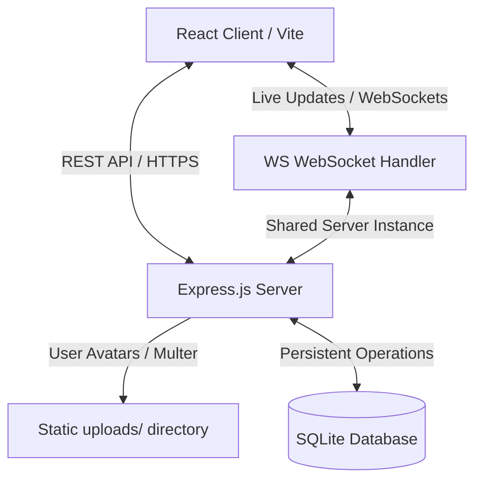

<p align="center">
  <svg width="128" height="128" viewBox="0 0 200 200" fill="none" xmlns="http://www.w3.org/2000/svg">
    <rect width="200" height="200" rx="44" fill="#081c3c" />
    <path d="M 35 140 C 35 140 70 140 85 140 C 60 115 50 75 75 50 C 100 25 140 30 160 60 C 170 75 172 90 168 105 C 160 128 135 142 110 140" stroke="#3b82f6" stroke-width="16" stroke-linecap="round" stroke-linejoin="round" />
    <path d="M 72 120 L 165 40" stroke="#3b82f6" stroke-width="16" stroke-linecap="round" />
    <path d="M 130 38 L 168 37 L 167 75" stroke="#3b82f6" stroke-width="16" stroke-linecap="round" stroke-linejoin="round" />
    <path d="M 92 78 L 118 78" stroke="#ffffff" stroke-width="12" stroke-linecap="round" />
    <path d="M 125 102 L 138 114" stroke="#ffffff" stroke-width="12" stroke-linecap="round" />
    <path d="M 128 146 L 168 146" stroke="#ffffff" stroke-width="12" stroke-linecap="round" />
    <path d="M 154 136 L 168 146 L 154 156" stroke="#ffffff" stroke-width="12" stroke-linecap="round" stroke-linejoin="round" />
  </svg>
</p>


<h1 align="center">🌌 AgileSpace</h1>

<p align="center">
  <strong>A Premium, Real-Time Collaborative Project Management Workspace</strong>
</p>

<p align="center">
  <a href="https://agilespace.onrender.com">
    
  </a>
</p>

<p align="center">
  
  
  
  
  
</p>

---

## 🌟 Introduction

AgileSpace is a premium, full-stack, state-of-the-art project management dashboard designed with modern team collaboration and visual focus at its core. It features a gorgeous glassmorphic interface, a fully interactive Kanban board with drag-and-drop actions, live real-time synchronization via WebSockets, and a delightful animated mascot that reacts in real-time to user sign-in flows.

AgileSpace operates on a **Unified Workspace Architecture**, ensuring that board changes, task movements, comments, and team invites are broadcasted instantaneously to all online members.

👉 **[Live Demo](https://agilespace.onrender.com)** 👈

---

## 🚀 Visual & Interaction Features

* **Animated Mascot Character**: An anime-style developer character on the login screen that changes visual states (`idle`, `watching`, `shy`, `peeking`) to match what the user is typing (reacts to credentials & password visibility toggles).
* **Draggable Kanban Board**: Fully interactive drag-and-drop layout to organize, delegate, and move tasks through stages (*To Do*, *In Progress*, *Review*, *Done*).
* **Contextual Right-Click Control**: Instant task actions (quick move or delete) via custom right-click menus directly on board cards.
* **Glassmorphic Aesthetic UI**: Premium dark mode design utilizing deep translucent layers, backdrop filters, custom color presets, and rich micro-animations.

---

## ⚡ Real-Time Collaboration & Backend

* **WebSocket Syncing**: Real-time room broadcast utilizing WS channels so team members witness live board movement and assignment changes instantly.
* **Granular Task Modals**: Dedicated overlays supporting rich descriptions, assignment pickers, due date indicators, and collaborative task comments.
* **Robust File Uploads**: Upload profile avatar pictures (supported by `multer` disc storage) or use fallback colored user initials.
* **Security & Auth**: Password encryption using `bcryptjs` and stateless, secure API communication utilizing JSON Web Tokens (JWT).

---

## 🏗️ System Architecture



---

## 🛠️ Tech Stack

* **Frontend**: React (v19), Javascript, vanilla CSS, Vite
* **Backend**: Node.js, Express.js
* **Real-Time Data**: WebSockets (`ws`)
* **Storage**: SQLite (`sqlite3` driver)
* **Auth**: JSON Web Tokens (`jsonwebtoken`), `bcryptjs`
* **File Uploads**: `multer`

---

## 💻 Installation & Local Running

### Prerequisites
* **Node.js** (v18.0.0 or higher)
* **npm** (v9.0.0 or higher)

### 1. Install Dependencies
AgileSpace is structured as a monorepo workspace. Install all package requirements for the root, frontend, and backend with a single command:
```bash
npm run install:all
```

### 2. Start Development Servers
Start the Vite frontend bundler (Vite on port `5173`) and Express backend API server (port `5001`) concurrently:
```bash
npm run dev
```
Open [http://localhost:5173](http://localhost:5173) in your browser.

> [!TIP]
> **Seeded Credentials**
> The database automatically seeds default members on startup. You can log in using:
> * **Email**: `alex@example.com` (or `sophie@example.com` / `marcus@example.com`)
> * **Password**: `password123`

---

## 🌐 Production & Deployment

In production, the Express backend serves compiled, static frontend build assets from the `frontend/dist` directory.

### 1. Build Client Assets
Compile the React code into optimized production assets:
```bash
npm run build:frontend
```

### 2. Start the Server
Start the Express API server (which dynamically hosts the built client from the same port):
```bash
npm run start
```

### 3. Deploying to Render.com
* Create a **Web Service** on Render and link your repository.
* **Build Command**: `npm run install:all && npm run build:frontend`
* **Start Command**: `npm run start`
* **Attach Persistent Volume**: Attach a disk with **Mount Path** `/opt/render/project/src/backend/data` and size `1 GB`.
* **Database Environment Variable**: Set `DATABASE_PATH` = `/opt/render/project/src/backend/data/project_manager.db` to prevent database loss during server sleep cycles.

---

## 🔒 Security

Please review our [SECURITY.md](SECURITY.md) guidelines for security practices and vulnerability reporting procedures.

---

## 📄 License

This project is licensed under the MIT License. See the [LICENSE](LICENSE) file for details.
