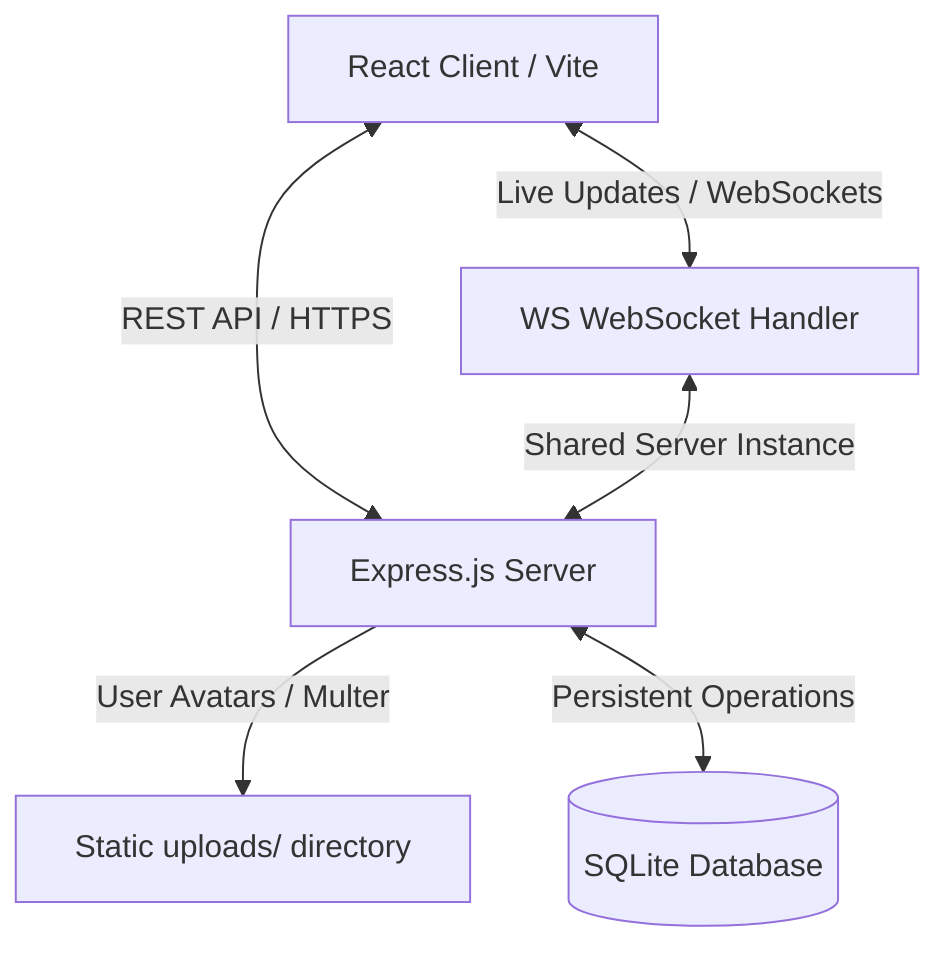

# 🌌 AgileSpace — Collaborative Project Management Tool

[](LICENSE)
[](https://nodejs.org/)
[](https://www.sqlite.org/)
[](#real-time-collaboration)

AgileSpace is a premium, highly responsive, and state-of-the-art collaborative project management system designed with modern aesthetics (glassmorphism, vibrant colors, custom dark mode, and smooth transitions). It features an interactive Kanban board, real-time board sync, instant user notifications, task management detail overlays, and a dynamic reacting anime mascot to elevate user engagement.

---

## 🎨 Design & Visual Features

* **Glassmorphic Theme**: A modern desktop workspace utilizing deep-space background tones, backdrop blur filters, and harmonious gradient accents.
* **Animated Mascot Character**: An anime-style developer character on the login screen that changes visual states (`idle`, `watching`, `shy`, `peeking`) to match what the user is typing (reacts to credentials & password visibility toggles).
* **Draggable Kanban Workflow**: Intuitive drag-and-drop mechanics to transition tasks between *To Do*, *In Progress*, *Review*, and *Done* states.
* **Fast Context Menu**: Right-click tasks anywhere on the board to quickly move them across statuses or delete them instantly.

---

## ⚡ Technical Features

* **Real-time Live Sync**: Powered by a robust WebSocket server (`ws`) to synchronize board states, member additions, and push notifications to all connected collaborators.
* **Granular Task Management**: Set descriptions, assign members, set due dates (with auto-overdue formatting), adjust priorities, and leave nested comments.
* **Comprehensive Profile Settings**: Choose initials fallback colors, crop & upload profile picture avatars, modify account details, update passwords, and delete accounts permanently.
* **Activity & Statistics Feed**: Visual dashboard tracking completion rate charts, active task distributions, and live timelines of workspace actions.

---

## 🏗️ System Architecture



---

## 🛠️ Technology Stack

* **Frontend**: React (v19), Javascript, vanilla CSS, Vite
* **Backend**: Node.js, Express.js
* **Real-Time Data**: WebSockets (`ws`)
* **Storage**: SQLite (`sqlite3` driver)
* **Auth**: JSON Web Tokens (`jsonwebtoken`), `bcryptjs`
* **File Uploads**: `multer`

---

## 🚀 Getting Started

### Prerequisites
* **Node.js** (v18.0.0 or higher)
* **npm** (v9.0.0 or higher)

### 1. Installation
AgileSpace is set up as a monorepo. Use the pre-configured script in the root directory to install all dependencies for both frontend and backend automatically:
```bash
npm run install:all
```

### 2. Run Locally in Development Mode
To start both the frontend development server (Vite on port `5173`) and backend Express server (port `5001`) concurrently:
```bash
npm run dev
```
Open [http://localhost:5173](http://localhost:5173) in your browser.

> [!TIP]
> **Seeded Credentials**
> The database automatically seeds default members on startup. You can log in using:
> * **Email**: `alex@example.com` (or `sophie@example.com` / `marcus@example.com`)
> * **Password**: `password123`

---

## 📦 Production & Deployment

For production, the Express server is configured to serve the built frontend assets statically from the `frontend/dist` directory.

### 1. Build the Frontend Assets
Compile the React code into optimized client assets:
```bash
npm run build:frontend
```

### 2. Start the Production Server
Start the Express server on your production host (it will serve the APIs and the static frontend assets from the same port):
```bash
npm run start
```

---

## 🌐 Online Hosting Guide (Render.com)

Render is the recommended platform to host AgileSpace. Follow these steps:

1. **Push to GitHub**: Link your repository to a GitHub account.
2. **Create Web Service**: Click **New +** -> **Web Service** on Render and connect your repository.
3. **Environment**: Select `Node` environment.
4. **Build & Start Commands**:
   * **Build Command**: `npm run install:all && npm run build:frontend`
   * **Start Command**: `npm run start`
5. **Persistent Disk (Crucial for SQLite)**:
   * Navigate to the **Disks** tab of your service.
   * Add a Disk with **Mount Path**: `/opt/render/project/src/backend/data` and size `1 GB`.
   * Add an Environment Variable: `DATABASE_PATH` = `/opt/render/project/src/backend/data/project_manager.db`.

> [!WARNING]
> If you deploy without attaching a persistent disk, your database file (`project_manager.db`) will reside on an ephemeral file system. Every time the server sleeps, restarts, or redeploys, all created projects, tasks, and users will be reset to the seed defaults.

---

## 🔒 Security and Support

Please review our [SECURITY.md](SECURITY.md) guidelines for security auditing, practices, and vulnerability reporting procedures.

---

## 📄 License

This project is licensed under the MIT License. See [LICENSE](LICENSE) for full details.
